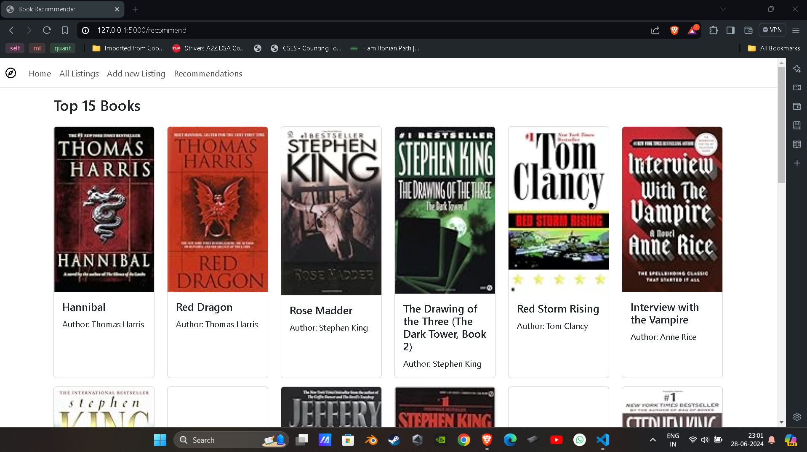
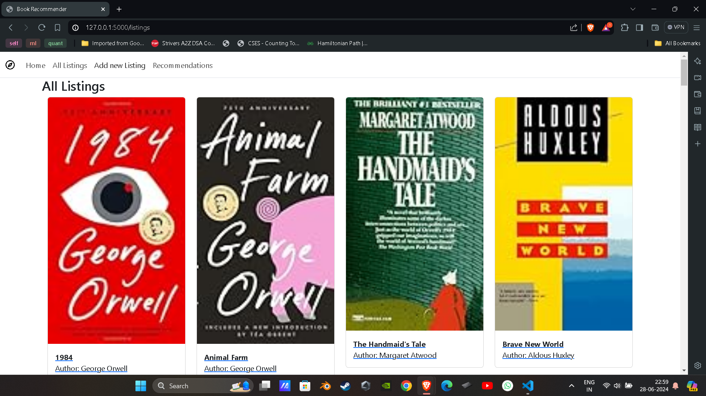
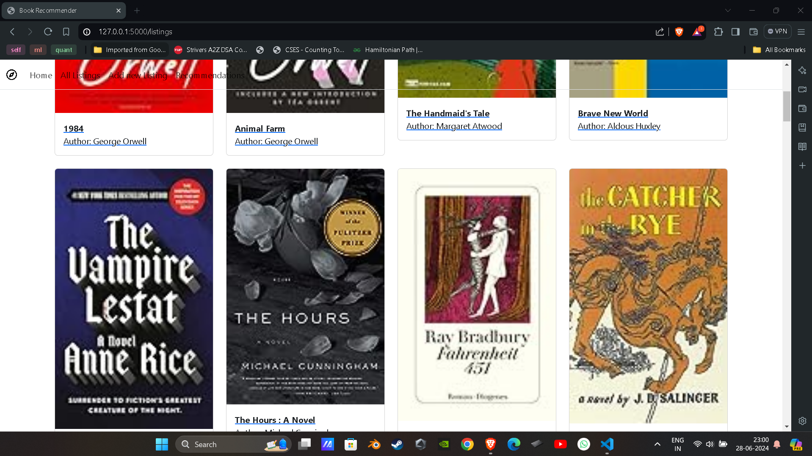
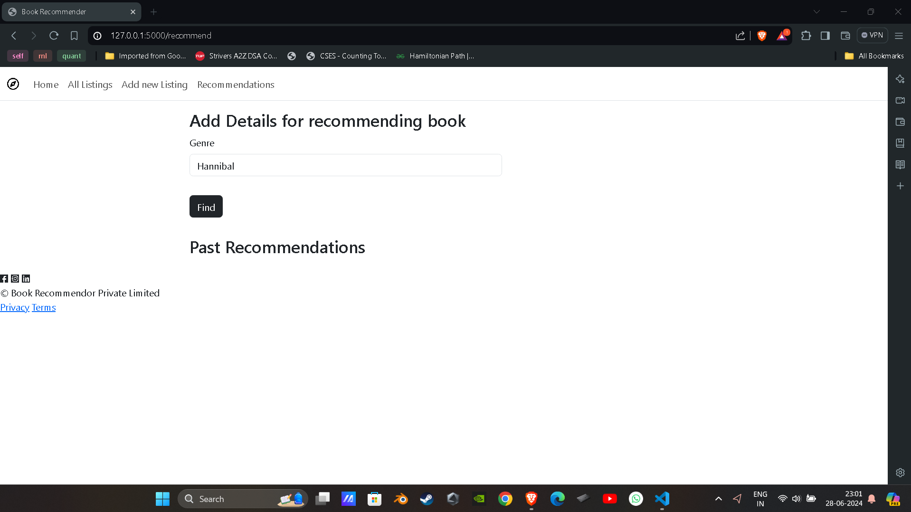

# OnlineLibrary: Your Next Read Awaits

Welcome to **OnlineLibrary**, your go-to book recommender system. This project was created to help you discover your next favorite book based on similarity scores, utilizing cosine similarity for precise recommendations. Developed during the Master Stack event at Concetto, IIT Dhanbad, OnlineLibrary is designed to enhance your reading experience by suggesting books that match your preferences.

## Features

- **Book Recommendations**: Get personalized book suggestions based on similarity scores.
- **Cosine Similarity**: Utilizes cosine similarity to measure how closely books are related to each other.
- **User-Friendly Interface**: Easy-to-use interface for seamless book discovery.
- **Extensive Book Database**: A wide range of books to choose from, ensuring there's something for everyone.

## Hosted Locally

This project was hosted locally to ensure smooth and efficient access during development and testing phases.

### Login Page

### All Listings Page

### Recommend Page

### Recommendation Page

